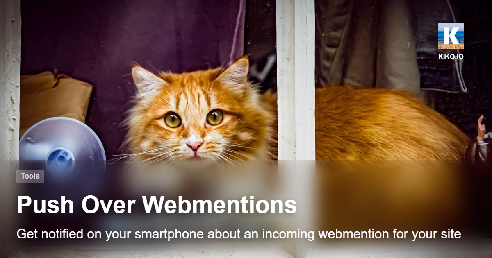

This small NodeJS service listens to incoming webhooks from **[webmention.io](https://webmention.io/)** and forwards them to an Android/iOS smartphone via **[Pushover](https://pushover.net/)**.

To get this run for you, you need to:

1. Fork this repo and clone it locally

2. Create an `.env` file in the root of your new project folder and add following values to the file:

| Key | Description |
| --- | ----------- |
| PORT | Every number between 1 and 65535 (Optional, Default 3000)  |
| WEBHOOK_SECRET | webmention.io Webhook Secret, you invent |
| PUSHOVER_USER | Pushover User Key you get here:  https://pushover.net |
| PUSHOVER_TOKEN | Pushover Application API Key you got here https://pushover.net/apps/*your-registered-application* |

3. Publish the Web Service via your forked repo on a hoster like [render.com](https://render.com/), [Azure App Services](https://azure.microsoft.com/services/app-service/) or the like. You will get an URL under which the service can be reached, for example *https://my-wmpush-service.onrender.com*

4. Enter the URL, including the POST path defined in the code, and the WEBHOOK_SECRET into the WEB HOOKS settings on webmention.io ... for example *https://my-wmpush-service.onrender.com/webhook*

5. Await you first Pushover notification for an incoming Webmention for your site ...

---

An introductory article is online on [kiko.io](https://kiko.io) ...

